# Interactive Audio Player
### Seven wearable players · Teensy 4.1 · 7.1 multichannel audio · NFC hand units · haptics

An embedded system for immersive, location-and-encounter based experiences. Each of up to
seven wearers carries a **hand unit** (NFC reader, distance sensor, vibration motor, LED ring).
Touching a hand unit to an **NFC tag** — another person's tag, a narrator tag, an overlay tag
or the start tag — changes what that wearer hears: the audio, a narration layer, overlays,
sound effects and a haptic channel that is felt through the body. The audio itself is a single
8-channel WAV file on an SD card inside each player.

This README is in two parts.

* **Part I — Operation manual:** preparing audio, the SD card and the configuration files,
  pairing the units, and running a show. Everything here needs no programming.
* **Part II — Building and programming:** hardware, setting up VS Code and PlatformIO, flashing
  the three devices, the project structure, and how the software works.

Background on design decisions, dead ends and open issues lives in [Context.md](Context.md).

> **Figures.** Every figure is a PNG; click it for the zoomable SVG. They are generated by
> `tools/make_docs.py` (see [section 17](#17-regenerating-the-figures)).

## Contents

**Part I — Operation manual**
1. [The system at a glance](#1-the-system-at-a-glance)
2. [The workflow in one picture](#2-the-workflow-in-one-picture)
3. [Preparing the audio](#3-preparing-the-audio)
4. [Preparing the SD card](#4-preparing-the-sd-card)
5. [Tags and the configuration files](#5-tags-and-the-configuration-files)
6. [Pairing hand units and body bridges](#6-pairing-hand-units-and-body-bridges)
7. [Running a show](#7-running-a-show)
8. [Changing files without removing the card (USB mode)](#8-changing-files-without-removing-the-card-usb-mode)
9. [Command reference](#9-command-reference)
10. [Troubleshooting](#10-troubleshooting)

**Part II — Building and programming**

11. [Hardware](#11-hardware)
12. [Setting up the development environment](#12-setting-up-the-development-environment)
13. [Building and flashing](#13-building-and-flashing)
14. [Project structure](#14-project-structure)
15. [How it works](#15-how-it-works)
16. [Tools reference](#16-tools-reference)
17. [Regenerating the figures](#17-regenerating-the-figures)

---

# Part I — Operation manual

## 1. The system at a glance

Each player is a set of three devices plus the wearer's tags:

| Device | What it is | What it does |
|---|---|---|
| **Hand unit** | ESP32-S3 SuperMini + PN532 NFC + VL53L0X distance sensor + vibration motor + 16-LED ring + LiPo | Reads tags, feels the distance to a hand, gives instant feedback (vibration, light) and reports to the body bridge |
| **Body bridge** | ESP32-S3 SuperMini | Receives the hand unit's wireless data (ESP-NOW) and passes it to the Teensy over a two-wire serial link; sends a heartbeat back |
| **Player** | Teensy 4.1 + SD card + PCM5102A (headphones) + MAX98357A (haptics) + LED ring | Plays the experience, decides what a tag means, drives headphones and the haptic transducer |

[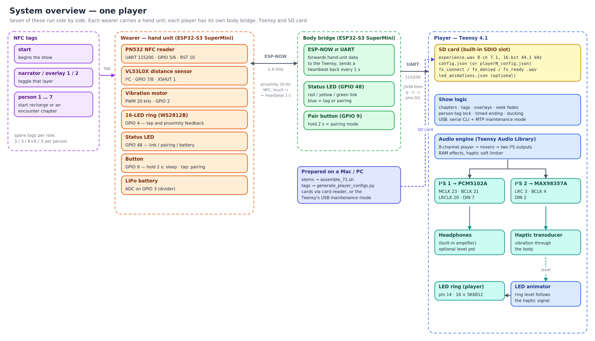](docs/system_overview.svg)

*Seven players run side by side, each with its own hand unit, body bridge, Teensy and SD card.
The pairs are independent: a hand unit talks to exactly one body bridge.*

## 2. The workflow in one picture

[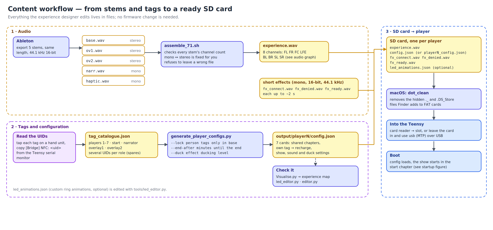](docs/content_workflow.svg)

Everything the experience designer edits is a **file**. Nothing in this manual needs a firmware
change. The short version:

1. Export five stems from Ableton and run `assemble_71.sh` → `experience.wav`.  → [section 3](#3-preparing-the-audio)
2. Format the SD cards and copy the files; clean the hidden macOS files.  → [section 4](#4-preparing-the-sd-card)
3. Read the tag UIDs, fill in `tag_catalogue.json`, run `generate_player_configs.py` → seven `config.json`.  → [section 5](#5-tags-and-the-configuration-files)
4. Pair each hand unit with its body bridge.  → [section 6](#6-pairing-hand-units-and-body-bridges)
5. Power everything up and run the show.  → [section 7](#7-running-a-show)

**Tools you need on the Mac/PC:** Python 3, `ffmpeg` (`brew install ffmpeg`), and a serial
monitor (VS Code with PlatformIO, see [section 12](#12-setting-up-the-development-environment),
or any terminal program at 115200 baud).

---

## 3. Preparing the audio

### 3.1 Export the stems from Ableton

Export five files — all **the same length**, on the same tempo grid, **44100 Hz, 16-bit**:

| File | Channels | Content |
|---|---|---|
| `base.wav` | stereo | The main music bed |
| `narr.wav` | **mono** | Narration / operator cues |
| `ov1.wav` | stereo | Overlay stem 1 |
| `ov2.wav` | stereo | Overlay stem 2 |
| `haptic.wav` | **mono** | Low-frequency content that is felt, not heard (the LFE channel) |

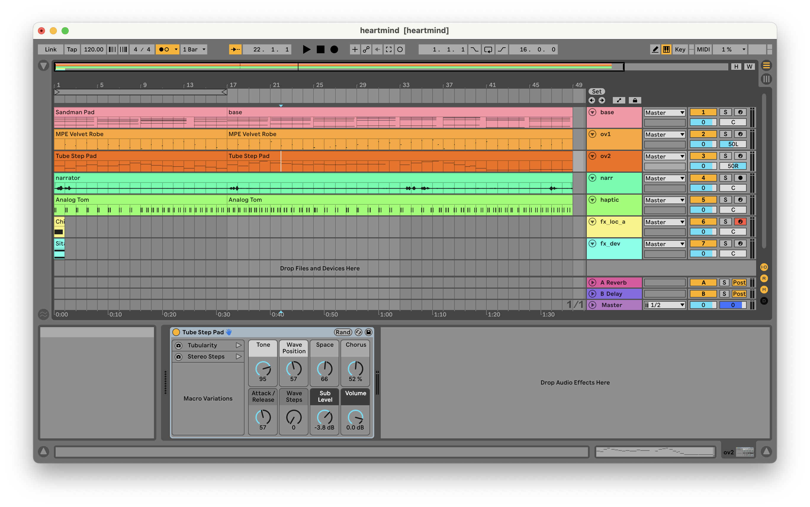

*The Ableton arrangement: base, narration, two overlays and the haptic stem exported separately.*

> **Mono export in Ableton:** *File → Export Audio/Video* → tick **Convert to Mono**.

### 3.2 Assemble the 8-channel file

```bash
chmod +x experience/assemble_71.sh
./experience/assemble_71.sh base.wav narr.wav ov1.wav ov2.wav haptic.wav experience.wav
```

The script checks every stem's channel count before merging, so a wrong export can no longer
silently shift every later channel:

* `narr.wav` / `haptic.wav` exported as **stereo** → reduced to mono (`(L+R)/2`; set
  `MONO_MODE=left` to take the left channel only). A dual-mono file keeps its exact level.
* `base.wav` / `ov1.wav` / `ov2.wav` exported as **mono** → duplicated to both channels.
* Anything with more than 2 channels, or a file that is not audio → refused with a message.
* The finished file must be **8 channels at 44100 Hz**; if not, it is deleted and the script
  fails. An existing `experience.wav` is left alone if the script fails before writing.
* **Different stem lengths:** the output is cut to the *shortest* stem. The script prints a
  warning with the shortest and longest length — fix the export, otherwise the end of the
  longer stems is silently lost.

Channel order of `experience.wav` (standard 7.1):

| Index | Name | Content | Goes to |
|---|---|---|---|
| 0 | FL | base L | headphones L (always on) |
| 1 | FR | base R | headphones R (always on) |
| 2 | FC | narration | both ears, fades in/out when toggled |
| 3 | LFE | haptic | MAX98357A → haptic transducer, and the player's LED ring |
| 4 | BL | overlay 1 L | headphones L, fades in/out when toggled |
| 5 | BR | overlay 1 R | headphones R, fades in/out when toggled |
| 6 | SL | overlay 2 L | headphones L, fades in/out when toggled |
| 7 | SR | overlay 2 R | headphones R, fades in/out when toggled |

A 7.5-minute experience is about **317 MB** (450 s × 44 100 × 2 bytes × 8 channels).

### 3.3 The sound effects

Three short effects give feedback for tag events. They are loaded into RAM at boot and played
without touching the SD card.

| File | Played when | Slot |
|---|---|---|
| `fx_connect.wav` | a person tag was accepted (a new chapter starts) | 4 |
| `fx_denied.wav` | a person tag was refused (lock on and not in base, or the show is ending) | 5 |
| `fx_ready.wav` | an encounter has ended and you are back in base, ready for the next | 6 |

**Format requirement: 16-bit PCM, mono, 44.1 kHz, up to about 2 seconds.** The player labels
every effect as mono 44.1 kHz and does not resample, so a stereo or 48 kHz file plays at the
wrong speed. The boot log prints one line per effect, e.g.
`slot 4: fx_connect.wav loaded (1ch 420ms … bytes RAM)` — `1ch` confirms a mono file.

Four older slots (`fx_dev.wav`, `fx_loc_a.wav`, `fx_loc_b.wav`, `fx_boot.wav`, slots 0–3) are
still loaded if present and can be triggered by `"do": "fx"` actions or `on_enter_fx`. If the
files are absent you will see four harmless `cannot open` lines at boot.

While any effect plays, the general audio is **ducked** (lowered) so the effect can be heard —
see `duck_level` in [section 5.4](#54-the-configuration-file-reference).

---

## 4. Preparing the SD card

Use a **SanDisk Ultra or Extreme (A1/A2, UHS-I)** card. A generic Class-4 card produced
audible glitches in testing. 16–32 GB is plenty. The Teensy's **built-in slot** (underside of
the board) is used, not a shield's slot.

### 4.1 What goes on the card

```
/ (SD card root)
├── experience.wav          the 8-channel audio (same file on every card)
├── config.json             this player's configuration (differs per card)
├── fx_connect.wav          effect: a person tag was accepted
├── fx_denied.wav           effect: a person tag was refused
├── fx_ready.wav            effect: back in base, ready for the next encounter
└── led_animations.json     optional: custom LED ring animations
```

`config.json` may also be called `playerN_config.json` (for example `player3_config.json`) so
the card is easy to recognise. The player opens **`/config.json`** if it exists; otherwise it
uses the **one** file in the card root whose name ends in `_config.json`. If there are several
such files it refuses to guess and loads nothing — keep exactly one. Hidden macOS `._…` files and
folders are ignored.

### 4.2 Formatting (macOS)

1. Insert the card, open **Disk Utility**, choose *View → Show All Devices*.
2. Select the **card itself** (the top-level device, not the volume below it).
3. Click **Erase** and set:
   * **Name:** something recognisable, e.g. `PLAYER3`
   * **Format:** **MS-DOS (FAT)** (this is FAT32)
   * **Scheme:** **Master Boot Record**
4. Erase. On Windows use the SD Association's *SD Memory Card Formatter* (FAT32).

### 4.3 Copying the files and cleaning up (macOS)

macOS silently writes hidden files to every FAT volume — `._filename` resource-fork files next to
each file you copy, plus `.DS_Store`, `.Spotlight-V100`, `.fseventsd` and `.Trashes`. They clutter
the directory the Teensy reads, so **always clean the card after copying**:

```bash
cp experience.wav            /Volumes/PLAYER3/
cp output/player3/config.json /Volumes/PLAYER3/
cp fx_connect.wav fx_denied.wav fx_ready.wav /Volumes/PLAYER3/

dot_clean /Volumes/PLAYER3/                      # merge/remove the ._ files
rm -rf /Volumes/PLAYER3/.Spotlight-V100 /Volumes/PLAYER3/.fseventsd /Volumes/PLAYER3/.Trashes
ls -la /Volumes/PLAYER3/                         # should list only your files
diskutil eject /Volumes/PLAYER3
```

Copying from the terminal with `cp` avoids most of the clutter; dragging in Finder creates the most.
**Run `dot_clean` again every time you change something on the card.**

### 4.4 Checking a card

Insert it, power the Teensy and open the serial monitor (115200 baud). A healthy boot shows,
in this order: `[SD] mounted OK`, `[Config] Loaded: 10 chapters, 11 tags (39 uids)…`, one line
per effect, `[Boot] Auto-starting -> 'start_arrival'`, `[Audio] Experience started`. The
complete startup order is in [section 15.5](#155-startup-sequences).

If the **onboard LED on the Teensy blinks fast forever**, the SD card could not be mounted
(wrong format, damaged card, or not inserted).

---

## 5. Tags and the configuration files

### 5.1 Tag roles

| Role | Tag type | What touching it does | Spares | Cooldown |
|---|---|---|---|---|
| **start** | `start` | jump to `base` **and start the show clock** (restarts the show if seen again) | 3 | 2 s |
| **person 1…7** | `person` | start a chapter: your **own** person's tag → `recharge`; the other six → `enc_play`, `enc_suspense`, `enc_loneliness`, `enc_nurture`, `enc_pressure`, `enc_shift` (ascending player number, skipping your own) | 3 per person | 4 s |
| **narrator** | `location` | toggle the narration layer | 3 | 1 s |
| **overlay 1** | `location` | toggle overlay 1 | 6 | 1 s |
| **overlay 2** | `location` | toggle overlay 2 | 6 | 1 s |

*Spares* are additional physical tags for the same role: any of them does the same thing and
they share one cooldown. You can program spares without touching any firmware.

> Overlays reset at every chapter change, because the generated chapters use
> `"overlay_mode": "fresh"`. Change a chapter to `"keep"` if an overlay should survive the change.

### 5.2 Reading a tag's UID

1. Open the Teensy's serial monitor at **115200 baud**.
2. Touch the tag to a paired hand unit.
3. Every detection is logged: `[Bridge] NFC: DE0CC698`. Copy the UID.
4. A tag that is not in the config additionally prints
   `[Bridge] Unknown tag: DE0CC698 -- add to config.json` when it is *confirmed*.

To check which role a UID already has: type `tag DE0CC698` in the Teensy serial monitor.

### 5.3 Generating the seven configs

All seven players share the same chapter timeline; only the `tags` section differs. Both the
timeline and the tag logic are generated by a script from one catalogue file.

1. Fill in **`configs/tag_catalogue.json`** — every physical tag, by role. Empty strings are spare
   slots that are not programmed yet (up to 8 tags per role):

   ```json
   {
     "players":  { "1": ["5040DABE", "", ""], "2": ["1033D9BE", "", ""], "...": [] },
     "start":    ["302FD9BE", "", ""],
     "narrator": ["805ADABE", "", ""],
     "overlay1": ["7034DABE", "", "", "", "", ""],
     "overlay2": ["", "", "", "", "", ""]
   }
   ```

2. Run the generator:

   ```bash
   python3 configs/generate_player_configs.py                 # testing build
   python3 configs/generate_player_configs.py --lock          # show build
   python3 configs/generate_player_configs.py --end-after 12 --duck 0.3
   ```

   | Option | Meaning | Default |
   |---|---|---|
   | `--lock` | person tags are only accepted while `base` is playing | off (switch at any time — for testing) |
   | `--end-after MIN` | minutes after the start tag until the ending begins; `0` = never | 10 |
   | `--duck LEVEL` | general-audio level while an effect plays, 0–1; `1` = no ducking | 0.4 |
   | `--catalogue`, `--out` | other input / output location | `configs/tag_catalogue.json`, `output/` |

3. The result is `output/player1/config.json` … `output/player7/config.json`. The generator
   prints how many tags each role still needs, refuses duplicate, malformed or over-limit UIDs
   (and writes nothing in that case), and warns about roles that have no tags yet.

4. **Re-run it and re-copy the configs to the cards whenever you change the catalogue.**

### 5.4 The configuration file reference

You normally never edit a generated config by hand, but you can: it is plain JSON, and changing
a card needs no reflash. Top level:

```json
{
  "device_id":      "PLAYER_1",
  "start_chapter":  "start_arrival",
  "led_brightness": 120,
  "idle":           { "led": { "animation": "breathe", "color": "0x000066", "intensity": 0.35, "speed": 0.2 } },

  "encounter_lock": false,
  "base_chapter":   "base",
  "sounds":         { "connect": 4, "denied": 5, "ready": 6 },
  "end_after_min":  10,
  "end_chapter":    "end_reflection",
  "duck_level":     0.4,

  "chapters": [ … ],
  "tags":     [ … ]
}
```

| Field | Meaning | If absent |
|---|---|---|
| `device_id` | name shown in the boot log | `UNIT_01` |
| `start_chapter` | chapter that plays from power-on (the waiting room) | `intro` |
| `led_brightness` | global LED brightness, 0–255 | 160 |
| `idle.led` | ring pattern when nothing is playing | — |
| `encounter_lock` | `true`: person tags only accepted in `base_chapter` | `false` |
| `base_chapter` | the hub chapter the lock refers to | `base` |
| `sounds` | RAM effect slot per event; `-1` = silent | all `-1` |
| `end_after_min` | minutes after the start tag until the ending begins (e.g. `0.5`); `0` = never | `0` |
| `end_chapter` | chapter that plays last; when it ends, sound and LEDs go off | `end_reflection` |
| `duck_level` | general audio is lowered to this fraction while an effect plays; `1` = off | `1` (off) |

#### Chapters

```json
{
  "id": "enc_play", "label": "Encounter — Play",
  "start_ms": 135000, "loop_end_ms": 180000,
  "loop": false, "returns_to": "base",
  "on_enter_fx": -1, "overlay_mode": "fresh",
  "overlays": { "ov1": false, "ov2": false, "narr": false },
  "led_background": { "animation": "level", "color": "0xCC4400", "intensity": 0.6, "speed": 0.3 },
  "led_enter":      { "animation": "flash", "color": "0xFFFFFF", "intensity": 0.6, "speed": 0.6, "duration_ms": 600 }
}
```

| Field | Description |
|---|---|
| `id` | unique name, used by tags, `start_chapter`, `returns_to`, `end_chapter` |
| `label` | human-readable name (serial debug and the map) |
| `start_ms` / `loop_end_ms` | the region of `experience.wav` this chapter plays |
| `loop` | `true`: loops between the two times · `false`: plays once |
| `returns_to` | for a non-looping chapter: the chapter to continue with when it ends; empty = go idle |
| `on_enter_fx` | RAM effect slot played on entry, `-1` = none |
| `overlay_mode` | `"fresh"`: apply `overlays` on entry · `"keep"`: inherit the current state |
| `overlays` | default state of `ov1`, `ov2`, `narr` (used when `fresh`) |
| `led_background` | the ring's persistent pattern in this chapter |
| `led_enter` | a one-shot flash when the chapter starts |

The generated timeline is ten 45-second chapters (7:30 in all):

| Chapter | Time | Plays | After it ends |
|---|---|---|---|
| `start_arrival` | 0:00 – 0:45 | loops | — (the waiting room) |
| `base` | 0:45 – 1:30 | loops | — (the hub) |
| `recharge` | 1:30 – 2:15 | once | `base` |
| `enc_play` | 2:15 – 3:00 | once | `base` |
| `enc_suspense` | 3:00 – 3:45 | once | `base` |
| `enc_loneliness` | 3:45 – 4:30 | once | `base` |
| `enc_nurture` | 4:30 – 5:15 | once | `base` |
| `enc_pressure` | 5:15 – 6:00 | once | `base` |
| `enc_shift` | 6:00 – 6:45 | once | `base` |
| `end_reflection` | 6:45 – 7:30 | once | sound and LEDs off |

To change the chapter times or LED colours for all seven cards, edit the `CHAPTERS` list in
`configs/generate_player_configs.py` and regenerate.

#### Tags and actions

```json
{
  "label": "Meet player 2 -> enc_play",
  "type": "person",
  "cooldown_ms": 4000,
  "uids": ["1033D9BE", "1033000A", "1033000B"],
  "actions": [ { "do": "chapter", "target": "enc_play" } ]
}
```

| Field | Description |
|---|---|
| `uid` and/or `uids` | one UID, or a list of spares (up to 8), upper-case hex; lower case is accepted and converted. A UID listed under two roles gives a warning; the first entry wins |
| `label` | description, shown in logs |
| `type` | `person`, `start`, `location` or the legacy `device`. Only `person` is affected by the lock and the ending; only `start` starts the clock |
| `cooldown_ms` | minimum time between two accepted touches of this role |
| `actions` | what to do (below) |

| `"do"` | Parameters | Effect |
|---|---|---|
| `"chapter"` | `"target": "id"` | jump to a chapter with a crossfade |
| `"overlay"` | `"target": "ov1"/"ov2"/"narr"`, `"value": "on"/"off"/"toggle"` | fade a layer in or out |
| `"fx"` | `"slot": 0-7` | play a RAM effect |
| `"led"` | `animation`, `color`, `intensity`, `speed`, `duration_ms` | a one-shot ring event |

A card holds at most **32 tag entries**; because spares share an entry, the full catalogue
(39 physical tags per card) needs only 11.

#### LED animations

Parameters: `color` = `"0xRRGGBB"` · `intensity` = 0–1 · `speed` = 0–1 · `duration_ms` (one-shots only).

| Name | Uses colour | Description |
|---|---|---|
| `level` | ✓ | **haptic sync** — the live envelope of the LFE channel |
| `heartbeat` | ✓ | **haptic sync** — a lub-dub shape |
| `breathe` | ✓ | smooth pulse between 25 % and 100 % |
| `solid` | ✓ | constant colour |
| `sparkle` | tint | dim base with random sparks |
| `fire` · `ocean` · `rainbow` | — | own palettes |
| `pulse_ring` | ✓ | ring expanding from the centre |
| `spin` | ✓ | an arc rotating around the ring |
| `flash` | ✓ | three quick flashes, then a dim hold |
| `confetti` | tint | random colour bursts |
| `comet` | ✓ | a dot racing with a trail |
| `off` | — | dark |

Custom animations are drawn with `tools/led_editor.py` and saved as `led_animations.json`
on the card; use the animation's `id` in any `animation` field. The animator checks custom ids
*before* the built-in names, so give custom animations distinct names.

### 5.5 Looking at a configuration

`experience/Visualise.py` draws a configuration: chapters on a timeline, overlay defaults, LED
colours, where every chapter goes when it ends, the start and end chapter, and which tag does what.

```bash
python3 experience/Visualise.py output/player1/config.json map.html --svg map.svg --png map.png
```

[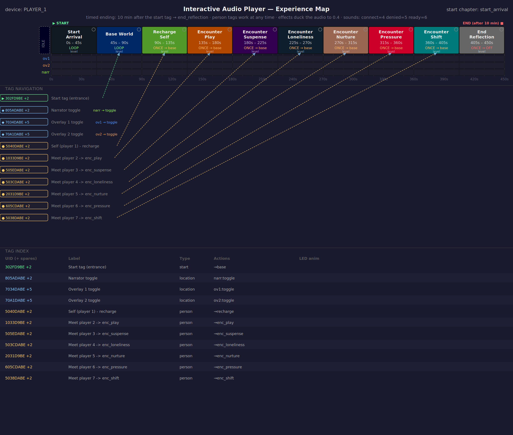](docs/experience_map.svg)

*Player 1's card. The tag rows show the first UID of each role and `+N` for its spares. Open
`docs/experience_map.html` for the same map in a browser.*

### 5.6 Editing tools and their limits

| Tool | Use it for | Limits |
|---|---|---|
| `configs/generate_player_configs.py` | **the normal way**: tags, timeline, show settings for all seven cards | chapter list is in the script |
| `tools/led_editor.py` | designing custom ring animations (`led_animations.json`) and previewing the built-ins | — |
| `tools/editor.py` | a web editor (http://localhost:8080) for one `config.json`: chapters, LEDs, overlays | shows only a single `uid` box and the old `location`/`device` types; it does **not** edit `uids` lists, `person`/`start` types or the newer top-level settings. It keeps them when it saves (it writes the whole object back), but edit those in a text editor |

Keep the generator's output as the master: if you hand-edit one card, remember that regenerating
overwrites it.

---

## 6. Pairing hand units and body bridges

A hand unit and a body bridge must be **paired** once; each stores the other's MAC address in
flash, so the pairing survives reboots and sleep. Pairing needs both units powered, close together,
and the hand unit **awake** — see the power notes in [section 7.1](#71-switching-on-and-off).

[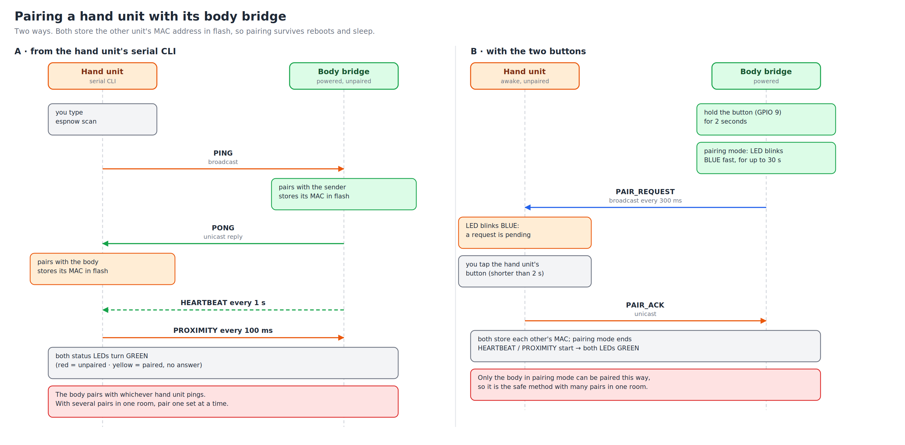](docs/pairing_sequence.svg)

### Method A — from the hand unit's serial CLI (verified)

1. Power the body bridge. Connect the hand unit to the computer, wake it (press its button) and
   open its serial monitor (115200 baud).
2. Type `espnow scan`. The hand unit broadcasts a PING, the body bridge pairs with the sender and
   answers; the hand unit pairs on the answer.
3. Both status LEDs turn **green**. In the hand unit's monitor you see `Paired: <MAC>` and then a
   `rx type=0x12` line every second (the heartbeat).

The body bridge pairs with **whichever hand unit pings**. With several pairs in one room, pair one
set at a time (power the others off) or use method B.

### Method B — with the two buttons

1. On the **body bridge**, hold the button (GPIO 9) for 2 seconds. Its status LED blinks **blue**
   fast: pairing mode, for up to 30 seconds. It broadcasts a pairing request every 300 ms.
2. The hand unit's status LED starts blinking **blue**: a request is pending.
3. **Tap the hand unit's button** (shorter than 2 seconds — a longer press puts it to sleep).
4. Both LEDs turn **green** and pairing mode ends.

Only the body bridge in pairing mode can be paired this way, so it is the safe method for several
pairs in one room. *Status: implemented and part of the firmware; this procedure had not been
confirmed end to end when this manual was written — if it fails, use method A and see
[Context.md](Context.md).*

### Checking and clearing

| | Hand unit | Body bridge |
|---|---|---|
| Show the pairing | `espnow` | `status` |
| Forget the pairing | `espnow clear` | `clear` |
| Set a peer by hand | `espnow bind <MAC>` | — |
| This unit's MAC | printed at boot (`[ESPNOW] MAC: …`) | `mac` |

[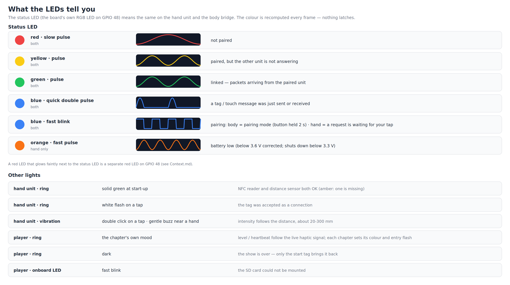](docs/led_language.svg)

*What the status LEDs mean on the hand unit and the body bridge.*

Label each pair (a sticker with the player number on both) — the units are otherwise identical.

---

## 7. Running a show

### 7.1 Switching on and off

* **Hand unit.** Connecting the battery or pressing reset makes the unit go **straight back to
  sleep**; **press the button** to start it. Once it is running, **hold the button for 2 seconds** to
  put it to sleep (the status LED flashes orange to confirm); press it again to wake. At start-up
  the ring lights **green** (NFC reader and distance sensor both found) or **amber** (one is
  missing), with two short vibration pulses.
* **Body bridge.** Powered whenever its supply is on; it has no sleep mode.
* **Player (Teensy).** Starts playing the waiting room as soon as it is powered — no tag needed.

The battery is monitored every 10 s: **orange fast pulse** on the status LED below 3.6 V, automatic
sleep below 3.3 V. On USB the battery cannot be measured and the unit says so
(`USB powered … battery not measurable`). See [section 9.2](#92-hand-unit-serial-monitor-115200-baud) for calibration.

### 7.2 A show

[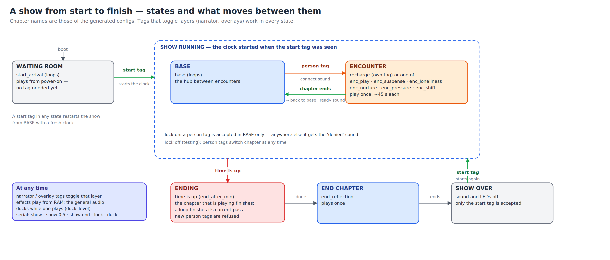](docs/show_flow.svg)

1. **Waiting room.** `start_arrival` loops from power-on.
2. **Start tag.** The wearer touches the start tag: `base` starts and the show clock begins.
3. **Encounters.** Touching another person's tag starts that encounter chapter (about 45 s) with the
   *connect* sound. Touching your own tag starts `recharge`. When the chapter ends you are back in
   `base` with the *ready* sound. With `--lock` (show build) a person tag is only accepted in `base`;
   anywhere else it gets the *denied* sound. Without it (testing build) person tags switch at any time.
4. **Layers.** Narrator and overlay tags toggle that layer in every state. Effects play from RAM and the
   general audio ducks while one plays.
5. **The ending.** `end_after_min` after the start tag the show wraps up: the chapter that is playing
   finishes (a looping chapter such as `base` finishes its current pass), new person tags are refused,
   then `end_reflection` plays.
6. **Over.** When `end_reflection` ends, the player's **sound and LED ring go off**. Hand units and body
   bridges keep running. Only the **start tag** is accepted now; it begins a new show from `base`.
   Rebooting the player also restarts everything.

Testing without waiting: `show 0.5` on the Teensy sets the ending to 30 seconds, `show end`
forces it now, `show start` does what the start tag does, `show` prints the state.

### 7.3 Before the doors open — checklist

- [ ] Every card has `experience.wav`, one `config.json`, the three effects; `dot_clean` was run
- [ ] Show build of the configs (`--lock`, the right `--end-after`)
- [ ] Hand units charged; each paired (green status LED) and labelled with its player number
- [ ] The Teensy log shows `[Config] Loaded …`, three effects loaded, no `Unknown tag` for any tag you hand out
- [ ] Each tag works: touch it, see the right chapter/overlay change in the Teensy log
- [ ] Headphones plugged in, volume pot where you want it, haptic transducer felt
- [ ] A last full run with `show 1` to hear the ending and the switch-off

---

## 8. Changing files without removing the card (USB mode)

The SD card sits under the Teensy and is awkward to remove. **USB maintenance mode** shares the card
with the computer over the Teensy's USB cable while the board stays in its case.

1. Connect the Teensy by USB and open the serial monitor (115200 baud).
2. Type **`usb`**. Playback stops, the LED ring spins **cyan**, and the card is shared over **MTP** as
   `SD Card`.
3. Open an **MTP client** on the computer. macOS has no built-in MTP support; use a third-party client
   (OpenMTP is one). Copy `config.json`, `experience.wav` or effects across.
4. Type **`reboot`**. The player restarts and reloads everything.

While in USB mode the player ignores tags and every command except `reboot` — the card belongs to the
computer. Large files (`experience.wav` is ~300 MB) take a while. If you also used Finder on the card,
run `dot_clean` once it is back in a reader.

---

## 9. Command reference

All three devices have a serial console at **115200 baud**. Commands are typed in the
monitor and confirmed with Enter.

### 9.1 Teensy player

| Command | Effect |
|---|---|
| `chapters` | list the chapters: times, loop or once, effect, LED, where they go next |
| `tags` | list the tag entries: first UID, number of UIDs, type, label, actions |
| `tag <uid>` | which role does this UID have? |
| `go <id>` | jump to a chapter (starts the audio if it is not running) |
| `seek <ms>` | seek to a raw time |
| `narr` · `ov1` · `ov2` | toggle that layer |
| `fx <n>` | play RAM effect slot *n* (`fx 4`, `fx 5`, `fx 6` test the three feedback sounds) |
| `bridge` | state of the link to the body bridge: alive, age of the last message, distance, touch |
| `show` | the show state: waiting, running (minutes elapsed), ending, over |
| `show <minutes>` | set the time until the ending (`show 0.5`); `show 0` = never. Not saved |
| `show start` / `show end` | do what the start tag does / force the ending now |
| `lock [on\|off]` | person tags only accepted in `base` / at any time. Not saved |
| `duck [0-1]` | show or set the ducking level (`duck 0.3`; `1` = off). Not saved |
| `haptic` · `haptic reset` | haptic settings and the loudest haptic peak seen · clear that peak |
| `hdrive <k>` | haptic soft-limiter drive, 0 = bypass … 8 (the default is 0.5) |
| `hgain <g>` | haptic mixer gain 0–4 (above 1 the mixer hard-clips — use `hdrive` for loudness) |
| `usb` | enter USB maintenance mode ([section 8](#8-changing-files-without-removing-the-card-usb-mode)) |
| `reboot` | restart the player |

Values set from the console are not saved; put the final value in the configuration (or the
`#define` at the top of `main.cpp`).

### 9.2 Hand unit (serial monitor, 115200 baud)

| Command | Effect |
|---|---|
| `help` | the command list |
| `status` · `debug` | all sensor readings · dump all state |
| `stream` | toggle a live distance stream |
| `scan` | I²C scan |
| `rainbow` · `solid <r> <g> <b>` · `bright <0-255>` · `off` · `idle` | ring test modes |
| `motor <pulses>` | trigger a vibration burst |
| `nfc` | re-run NFC init and poll for 3 s |
| `sleep` | go to deep sleep |
| `espnow` · `espnow scan` · `espnow bind <MAC>` · `espnow clear` · `espnow test` | pairing and link ([section 6](#6-pairing-hand-units-and-body-bridges)) |
| `battery` | battery level, rail voltage, divider-pin voltage, offset |
| `battery cal <batV> <pinV>` | set this unit's offset from two multimeter readings taken **on battery**: the voltage at the battery terminals and at GPIO 3, e.g. `battery cal 3.80 1.74` |
| `battery offset <mV>` · `battery clear` | set the offset directly · back to the default |
| `tof` | distance-sensor diagnostics: settings, counters, status codes seen |
| `tof raw` | toggle: print every measurement with its status, signal rate and SPAD count |
| `tof rate <mcps>` · `tof budget <ms>` · `tof period <ms>` · `tof long on\|off` | sensor tuning |
| `tof min <mm>` · `tof max <mm>` | the window of readings that count |
| `tof defaults` · `tof save` · `tof clear` · `tof reset` | defaults · store/erase this unit's settings in flash · clear counters |

**Battery:** the voltage divider on this board hangs on the board's 5 V rail behind a Schottky diode,
so on battery the reading is the cell voltage minus about 0.3 V. The firmware adds a per-unit offset
(default 320 mV) and treats any rail above 4.3 V as USB power ("battery not measurable").

### 9.3 Body bridge

| Command | Effect |
|---|---|
| `status` | pairing, last packet, counters for the paired hand, uptime, foreign traffic |
| `mac` | this unit's MAC address |
| `stream` | toggle a continuous proximity stream |
| `clear` | forget the paired hand unit |
| `help` · `?` | the list |

---

## 10. Troubleshooting

| Symptom | Likely cause | What to do |
|---|---|---|
| Teensy's onboard LED blinks fast forever | SD card not mounted | reformat FAT32 ([4.2](#42-formatting-macos)); check the card is seated |
| `[Config] ERROR: cannot open /config.json` | no `config.json`, or it is named something else | name it `config.json`, or keep exactly one `*_config.json` ([4.1](#41-what-goes-on-the-card)) |
| `[Config] ERROR: … files match *_config.json` | several `*_config.json` on the card | remove all but one |
| No headphone sound, haptics fine | PCM5102A muted: its `H3L` (XSMT) jumper is not bridged to **HIGH** | bridge `H3L` to H; `H1L`, `H2L`, `H4L` to L |
| No haptics, headphones fine | MAX98357A in shutdown: its SD pin must be tied to VIN | check the wiring ([11.3](#113-the-audio-boards)) |
| No audio and `[Audio] ERROR: experience.wav not found` | file missing or misnamed | check the card; run `dot_clean` |
| Stuttering / clicking audio | slow card, or hidden macOS files | SanDisk A1/A2 card; `dot_clean` |
| Hand unit "does nothing" after connecting power | it goes to sleep after a reset | press the button once |
| Status LED **red** | not paired | pair ([6](#6-pairing-hand-units-and-body-bridges)) |
| Status LED **yellow** | paired, but the other unit is not answering | is the other unit on? in range? same pair? |
| LED colours swapped (red shows green) | a **v0.0.2** SuperMini board (RGB order); the standard board is GRB | use the standard board, or build with `-DSTATUS_LED_ORDER=RGB` |
| Touching a tag does nothing | the UID is not in the config (`Unknown tag` in the log); or the tag's cooldown has not elapsed; or the show is over / ending / locked | check the log: it says why (`ignored`, `refused`, `cooling down`) |
| After the show nothing responds | the show is over | touch the **start tag**, or reboot the player |
| A person tag gets the *denied* sound | the lock is on and you are not in `base`, or the show is ending | finish the chapter first; `lock off` for testing |
| Effects are inaudible | the general audio is too loud | set `duck_level` lower ([5.4](#54-the-configuration-file-reference)); try `duck 0.3` live |
| An effect plays too slowly / too long | file is stereo or not 44.1 kHz | re-export mono 16-bit 44.1 kHz |
| `assemble_71.sh` reports a channel count problem | a stem has the wrong number of channels | re-export; the message names the file |
| Output shorter than the stems | stems have different lengths; the output is cut to the shortest | re-export all stems with the same length |
| Hand-unit battery shows 4.8 V | the unit is on USB: the rail is USB power | run on battery; calibrate with `battery cal` |
| Orange low-battery pulse at a real 3.8 V | missing diode correction | `battery cal <batV> <pinV>` |
| Distance sensor only reacts when very close | weak return signal, or the signal-rate limit | run `tof raw` and read the status codes and signal rate; compare with a good unit ([Context.md](Context.md)) |
| Build error `'FS' has not been declared` / `redefinition of 'class MTPStorage'` (Teensy) | FastLED 3.10.2/3.10.3 with the MTP USB type, or the external MTP library added | keep FastLED at 3.10.1; do not add the MTP_Teensy library ([12.3](#123-library-and-platform-pins)) |
| ESP32 build error about ESP-NOW callback signatures | wrong Arduino core (3.x) | pin `platformio/espressif32@6.13.0` ([12.3](#123-library-and-platform-pins)) |

---

# Part II — Building and programming

## 11. Hardware

### 11.1 Parts

| Part | Notes |
|---|---|
| Teensy 4.1 | 600 MHz Cortex-M7; built-in SDIO SD slot; USB serial + MTP |
| PCM5102A DAC module | headphone audio on I²S 1; solder-jumper settings below |
| MAX98357A amplifier module | haptic transducer on I²S 2 |
| Headphones with built-in amplifier | an analog potentiometer reduces the level |
| 16-LED ring (SK6812 / WS2812) | on the player, pin 14 |
| 2 × ESP32-S3 SuperMini | one for the hand unit, one for the body bridge. Use the **standard** boards, not v0.0.2 (different LED colour order and USB wiring) |
| PN532 NFC module | hand unit; set its DIP switches for **UART** mode |
| VL53L0X time-of-flight module | hand unit; distance to a hand |
| Vibration motor + driver | hand unit |
| 16-LED WS2812B ring | hand unit |
| LiPo battery (1S, 3.0–4.2 V) | hand unit; charged through the SuperMini's TP4054 |
| Push buttons | hand unit (GPIO 9), body bridge (GPIO 9) |
| SanDisk Ultra / Extreme A1 or A2 SD card | one per player |

### 11.2 Pinouts

**Teensy 4.1**

| Function | Pins |
|---|---|
| I²S 1 → PCM5102A | MCLK 23 · BCLK 21 · LRCLK 20 · DIN 7 |
| I²S 2 → MAX98357A | LRC 3 · BCLK 4 · DIN 2 |
| Body-bridge UART (Serial1, 115200) | pin 0 (RX1) ← bridge GPIO 43 (TX) · pin 1 (TX1) → bridge GPIO 44 (RX) · common GND |
| LED ring (16 × SK6812) | pin 14, 5 V and GND (an external 5 V supply is recommended) |
| SD card | built-in SDIO slot |
| Onboard LED | pin 13: fast blink = SD mount failed |

**Hand unit — ESP32-S3 SuperMini**

| Function | GPIO |
|---|---|
| LED ring (WS2812B, 16, GRB) | 4 |
| Vibration motor (PWM 20 kHz, 8 bit) | 2 |
| VL53L0X: SDA / SCL / XSHUT | 7 / 8 / 1 |
| PN532 (UART 115200): TX / RX / RST | 6 / 5 / 10 |
| Status LED (onboard RGB) | 48 |
| Button (to GND, internal pull-up) | 9 |
| Battery divider (1:2, equal resistors) | 3 |

**Body bridge — ESP32-S3 SuperMini**

| Function | GPIO |
|---|---|
| Teensy UART (Serial1, 115200): TX / RX | 43 / 44 |
| Status LED (onboard RGB) | 48 |
| Pair button (to GND, internal pull-up) | 9 |

### 11.3 The audio boards

* **PCM5102A:** its four solder jumpers set the filter, de-emphasis, soft-mute and format. Bridge
  `H1L` (FLT) to L, `H2L` (DEMP) to L, **`H3L` (XSMT) to H**, `H4L` (FMT, I²S) to L. The factory
  default leaves `H3L` low, which keeps the output muted. The module's `SCK` pin is grounded
  (its internal PLL generates the clock).
* **MAX98357A:** tie **SD to VIN** (it has an internal pull-down, so a floating SD pin means
  shutdown). GAIN floating gives 9 dB; GAIN to GND 12 dB; GAIN through 100 kΩ to GND 15 dB (per the
  datasheet).
* The haptic signal is mono and is sent to both I²S 2 channels.

### 11.4 PCBs

Two boards were designed for this project. Schematics and board layouts are exported as PNG (shown
here) and PDF. *The files in `docs/` are placeholders until the real exports are dropped in under the
same names.*

**Player PCB** — Teensy 4.1 carrier with the PCM5102A, the MAX98357A, the LED-ring connector and the
bridge UART.

| Schematic | Board layout |
|---|---|
| [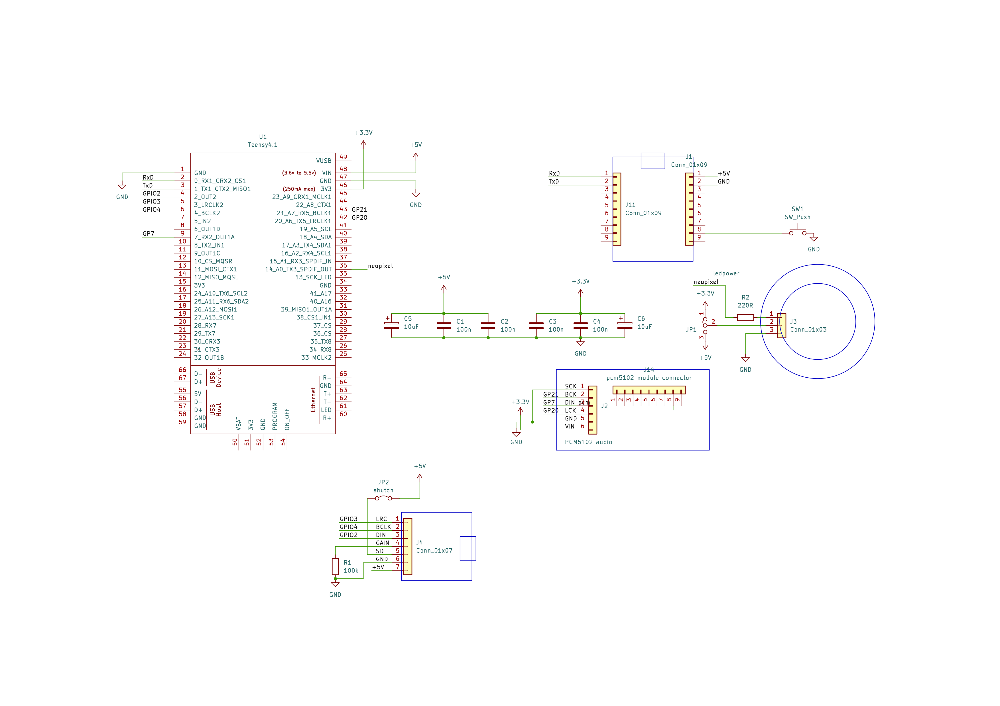](docs/pcb_player_schematic.pdf) | [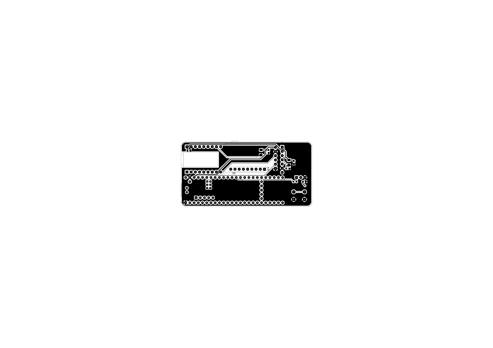](docs/pcb_player_board.pdf) |
| [PDF](docs/pcb_player_schematic.pdf) | [PDF](docs/pcb_player_board.pdf) |

**Hand unit PCB** — ESP32-S3 SuperMini, PN532, VL53L0X, motor driver, LED ring and battery.

| Schematic | Board layout |
|---|---|
| [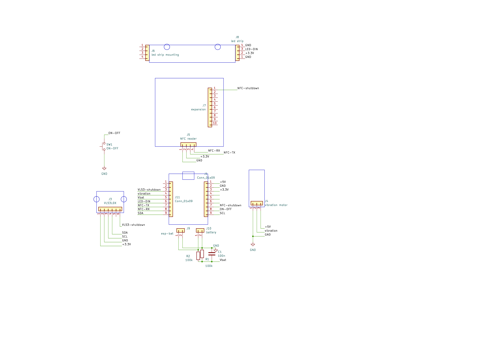](docs/pcb_hand_unit_schematic.pdf) | [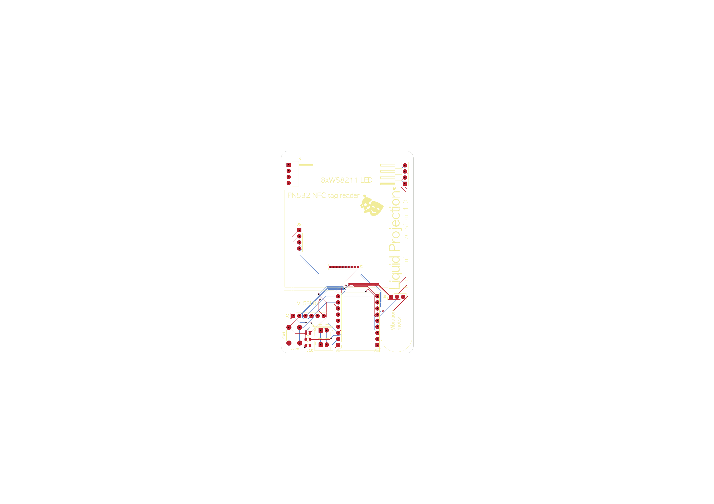](docs/pcb_hand_unit_board.pdf) |
| [PDF](docs/pcb_hand_unit_schematic.pdf) | [PDF](docs/pcb_hand_unit_board.pdf) |

---

## 12. Setting up the development environment

### 12.1 Install

1. **VS Code** — <https://code.visualstudio.com>.
2. In VS Code, install the **PlatformIO IDE** extension (it installs its own Python and the `pio`
   command). Restart VS Code when asked.
3. **Python 3** and **ffmpeg** for the tools: `brew install python ffmpeg` on macOS. The Python tools were
   tested with Python 3.9 (the version macOS ships), 3.11 and 3.12; check yours with `python3 --version`.
4. For the documentation figures only: `pip install cairosvg pillow`.
5. Clone the repository and open each device's folder in VS Code (below).

The repository holds **three PlatformIO projects**; open each as its own workspace (or add them
as a multi-root workspace):

| Folder | Device | Environment |
|---|---|---|
| repository root (`platformio.ini`) | Teensy player | `teensy41` |
| `ESP32handUnit/` | hand unit | `hand_unit` |
| `ESP32bodyBridge/` | body bridge | `body_bridge` |

PlatformIO downloads the platforms and libraries on the first build.

### 12.2 Serial ports

On macOS the boards appear as `/dev/cu.usbmodem…`. List them with `pio device list`. With several
boards connected, select the port explicitly (`--port` for the monitor, `--upload-port` for uploads).
The Teensy's port changes when its USB type changes (it is *Serial + MTP* here).

### 12.3 Library and platform pins

These versions were tested together. **Do not float them** — the toolchain moved underneath this
project several times (details in [Context.md](Context.md)).

| Project | Pin | Why |
|---|---|---|
| ESP32 (both) | `platform = platformio/espressif32@6.13.0` | the official platform; Arduino core 2.0.17. Core 3.x changes the ESP-NOW callback signatures and the LEDC (PWM) API; the community **pioarduino** platform was abandoned (its bundled esptool 5.4.0 crashed on upload) |
| ESP32 (both) | `board = esp32-s3-devkitc-1`, flags `-DARDUINO_USB_CDC_ON_BOOT=1 -DCORE_DEBUG_LEVEL=0` | the SuperMini's USB serial; quiet logs |
| ESP32 hand unit | `fastled/FastLED @ ^3.6.0`, `pololu/VL53L0X @ ^1.3.1`, Seeed `PN532` (git) | |
| Teensy | `platform = teensy`, `board = teensy41` (core Teensyduino 1.60) | the core already contains MTP |
| Teensy | `-DAUDIO_BLOCK_SAMPLES=128`, `-DUSB_MTPDISK_SERIAL` | the Audio Library's fixed block size; USB serial **plus** MTP |
| Teensy | `fastled/FastLED @ 3.10.1` | 3.10.2 / 3.10.3 compile an SD-card file that breaks the MTP headers on case-insensitive filesystems |
| Teensy | `bblanchon/ArduinoJson @ ^7.0.0` | config and bridge parsing |
| Teensy | do **not** add the `MTP_Teensy` library | Teensyduino 1.60 bundles it; adding it redefines the same classes |

To confirm an ESP32 build uses the right platform, look for these lines in the build output:

```
PLATFORM: Espressif 32 (6.13.0) > Espressif ESP32-S3-DevKitC-1-N8 …
 - framework-arduinoespressif32 @ 3.20017.241212+sha.dcc1105b      (= Arduino core 2.0.17)
```

---

## 13. Building and flashing

```bash
# Teensy player (repository root)
pio run                       # build
pio run -t upload             # build + flash (the Teensy Loader opens)
pio device monitor -b 115200

# Hand unit / body bridge
cd ESP32handUnit   && pio run -t upload && pio device monitor -b 115200
cd ESP32bodyBridge && pio run -t upload && pio device monitor -b 115200

pio run -t clean              # clean build
```

* **Teensy:** if the Teensy Loader waits for the board, press the small program button on the Teensy.
* **ESP32-S3 SuperMini:** if an upload cannot find the board, put it in download mode — **hold BOOT,
  tap RESET, release BOOT** — and upload again. A new board usually needs this for its first flash.
* **Wrong LED colours** on a board: it is probably a v0.0.2 variant; add
  `-DSTATUS_LED_ORDER=RGB` to that project's `build_flags`, or use a standard board.
* The hand unit's configuration constants (pins, timings, thresholds, `POWER_MANAGEMENT`,
  `NFC_UART`) are in `ESP32handUnit/src/Config.h`; the body bridge's in `ESP32bodyBridge/src/Config.h`.
  The Teensy's tunables (`HAPTIC_DRIVE_DEFAULT`, `DUCK_ATTACK_MS`, …) are `#define`s at the top of
  `src/main.cpp`.

---

## 14. Project structure

```
.
├── README.md  Context.md
├── platformio.ini                  Teensy project
├── src/                            Teensy firmware
│   ├── main.cpp                    setup / loop / state machine / CLI
│   ├── AudioPlaySdWavMulti.h       custom 8-channel WAV player with deferred seek
│   ├── EspBridge.h                 UART JSON line reader (body bridge link)
│   ├── ConfigLoader.h              config.json → typed structs (multi-UID tags, show settings)
│   ├── LedAnimator.h               non-blocking ring animations
│   ├── RamPlayer.h                 short effects held in RAM
│   └── UsbMaintenance.h            USB MTP maintenance mode
├── ESP32handUnit/                  hand-unit firmware (own platformio.ini)
│   └── src/  main.cpp Config.h EspNow.h Proximity.h NfcTask.h Motor.h LedRing.h Statusled.h
│             PowerManager.h TouchManager.h Cli.h
├── ESP32bodyBridge/                body-bridge firmware (own platformio.ini)
│   └── src/  main.cpp Config.h EspNow.h PairButton.h Statusled.h Cli.h
├── configs/
│   ├── tag_catalogue.json          every physical tag, by role
│   ├── generate_player_configs.py  catalogue + chapter timeline → playerN config.json
│   └── …                           (generated output goes to output/)
├── experience/
│   ├── assemble_71.sh              stems → 8-channel experience.wav
│   └── Visualise.py                config → experience map (HTML / SVG / PNG)
├── tools/
│   ├── editor.py                   web config editor
│   ├── led_editor.py               LED animation editor
│   └── make_docs.py                regenerates the figures in docs/
├── led_animations.json             example custom animation
└── docs/                           figures (SVG + PNG), PCB schematics and boards
```

---

## 15. How it works

### 15.1 The audio engine

[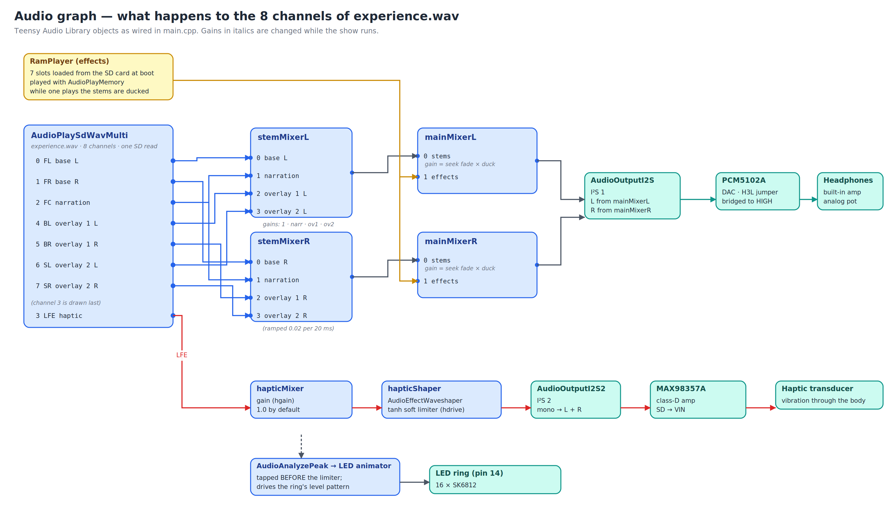](docs/audio_graph.svg)

* **One file, one SD read.** Reading several WAV files at once made the SD bus serialise and the CPU
  spike; a single 8-channel interleaved file costs about 4 % CPU. The custom player
  (`AudioPlaySdWavMulti`) also does its seeks **inside the audio interrupt** (a pending-seek flag),
  because a seek from `loop()` raced with the interrupt and silently stopped the player.
* **Chapter changes** crossfade: the stems fade out (0.05 per 20 ms ≈ 0.4 s), the player seeks, they fade
  back in. Overlays and narration fade at 0.02 per 20 ms (≈ 1 s).
* **Ducking.** While a RAM effect plays, `mainMixer` channel 0 is multiplied by a ducking envelope —
  down in 40 ms, back up in 400 ms — on top of the seek fade.
* **Haptics.** The LFE channel goes through a **soft limiter** (a `tanh` waveshaper; `hdrive` sets its
  strength) into the MAX98357A. The LED ring's `level` pattern is tapped *before* the limiter.
* **Headphones.** Mixer output goes straight to the PCM5102A; there is no master gain stage (the
  headphones have their own amplifier).

### 15.2 The show logic

[](docs/experience_map.svg)

A tag arrives from the body bridge as a *confirmed connection* (`"t":"c"`). `main.cpp` looks the UID up
(`ConfigLoader::findTagIndex`, which searches every spare), checks the per-tag cooldown, and then:

1. **Show over?** Only a `start` tag is accepted.
2. **Person tag?** Refused while the show is ending, or when the lock is on and the current chapter is
   not the base chapter (→ *denied* sound). Otherwise accepted (→ *connect* sound after its actions).
3. Runs the tag's **actions** (chapter jump with crossfade, overlay change, effect, LED event).
4. A `start` tag also **starts the show clock** (`beginShow()`).

The loop checks the clock every pass: when `end_after_min` has elapsed it sets the *ending* flag; a
looping chapter is released (switched to play-once so it stops at its loop end). When a chapter that plays
once ends: the end chapter → `endShow()` (player stopped, ring `off`); otherwise, during the ending →
the end chapter; otherwise `returns_to` (with the *ready* sound when it is `base`); otherwise idle.

### 15.3 The wireless link and the protocols

[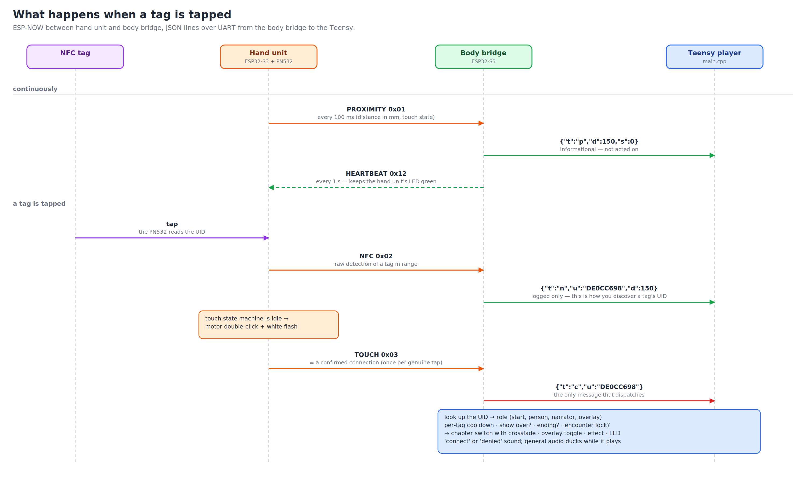](docs/runtime_messages.svg)

**ESP-NOW** (hand unit ⇄ body bridge, 2.4 GHz, unicast between the paired units):

| Type | Code | Direction | Meaning |
|---|---|---|---|
| `MSG_PROXIMITY` | `0x01` | hand → body | distance + touch state, every 100 ms |
| `MSG_NFC` | `0x02` | hand → body | raw tag detection |
| `MSG_TOUCH` | `0x03` | hand → body | confirmed connection |
| `MSG_PING` / `MSG_PONG` | `0x10` / `0x11` | hand ↔ body | `espnow scan` pairing |
| `MSG_HEARTBEAT` | `0x12` | body → hand | every 1 s |
| `MSG_PAIR_REQUEST` | `0x20` | body → all (broadcast) | button pairing mode |
| `MSG_PAIR_ACK` | `0x21` | hand → body | the hand unit's tap |

The body bridge accepts data **only from the paired hand**; everything else is counted as "foreign" and
ignored. A link is considered up while packets keep arriving (2 s on the body, 3.5 s on the hand).

**Body bridge → Teensy**, newline-terminated JSON at 115200 baud:

```json
{"t":"p","d":150,"s":0}                  proximity (informational)
{"t":"n","u":"DE0CC698","d":150}         raw NFC detection (logged; shows the UID)
{"t":"c","u":"DE0CC698"}                 confirmed connection — the only one that dispatches
```

The hand unit's own touch state machine debounces and enforces a silence period after a connection, so
`c` fires once per genuine tap; the per-tag cooldown on the Teensy is a second safety net.

### 15.4 Pairing

See the figure in [section 6](#6-pairing-hand-units-and-body-bridges). Both methods store the partner's MAC
in flash (`Preferences`). Pairing by `espnow scan` is by broadcast; by buttons it is by an explicit
request/acknowledge.

### 15.5 Startup sequences

**Teensy player**

[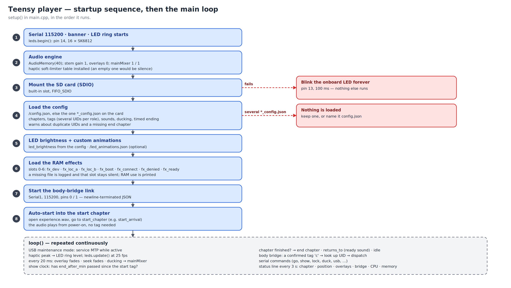](docs/boot_teensy.svg)

**Hand unit**

[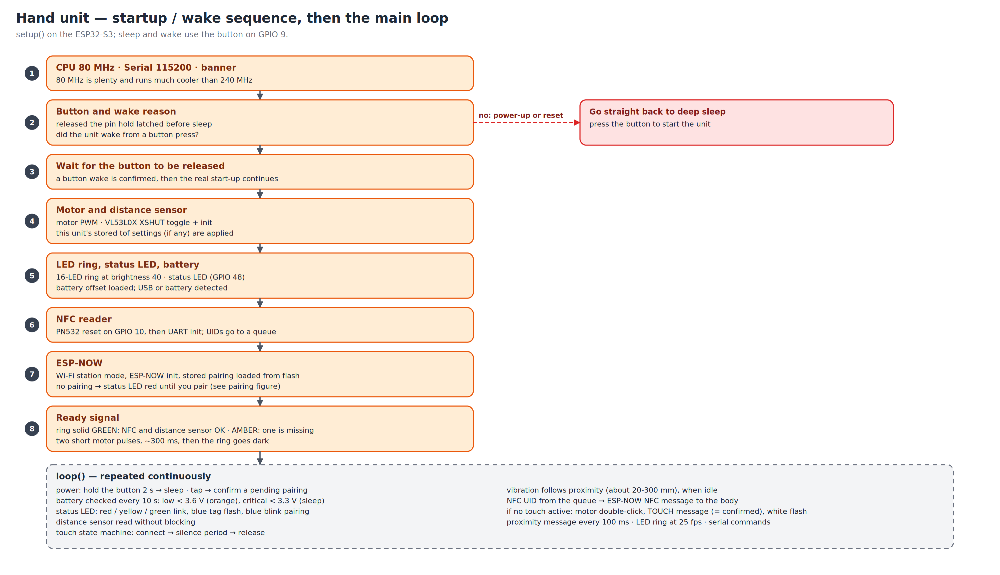](docs/boot_hand.svg)

**Body bridge**

[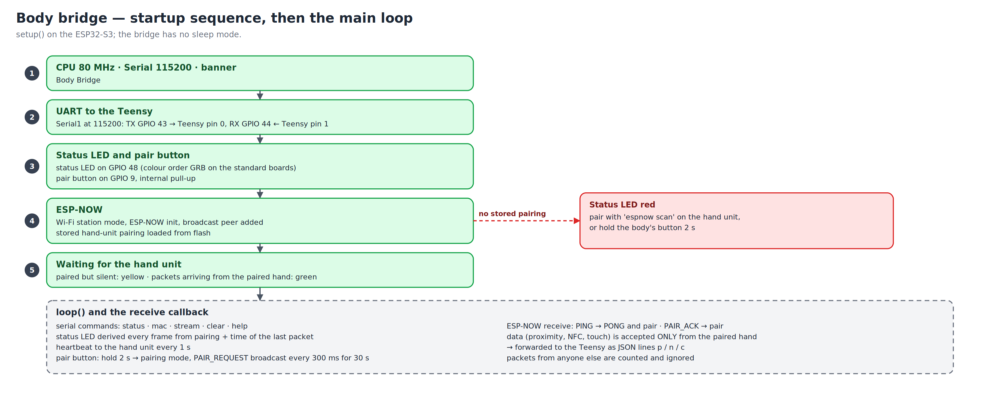](docs/boot_body.svg)

### 15.6 Power management (hand unit)

The unit runs at 80 MHz (240 MHz ran hot). A reset or power-up goes to deep sleep; the button (GPIO 9) wakes
it. Before sleeping the motor, LEDs and radio are stopped, and the PN532 reset and button lines are held so
they do not float. The battery monitor is explained in [section 9.2](#92-hand-unit-serial-monitor-115200-baud).

### 15.7 The distance sensor

The VL53L0X is read without blocking. A reading counts when it lies between `tof min` (default 50 mm — below
that is crosstalk) and `tof max` (2000 mm) and the sensor accepted it. Vibration follows proximity between
about 20 and 300 mm. `tof raw` shows, per measurement, the device status code, the return signal rate, the
ambient rate and the SPAD count, which is how a weak unit is diagnosed.

---

## 16. Tools reference

| Tool | Run | Purpose |
|---|---|---|
| `experience/assemble_71.sh` | `./assemble_71.sh base.wav narr.wav ov1.wav ov2.wav haptic.wav experience.wav` | stems → 8-channel WAV (with channel checks) |
| `configs/generate_player_configs.py` | `python3 configs/generate_player_configs.py [--lock] [--end-after MIN] [--duck L]` | the seven player configs |
| `experience/Visualise.py` | `python3 experience/Visualise.py cfg.json out.html [--svg f.svg] [--png f.png]` | draw a configuration |
| `tools/editor.py` | `python3 tools/editor.py path/to/config.json` | web editor on http://localhost:8080 |
| `tools/led_editor.py` | `python3 tools/led_editor.py /Volumes/PLAYER3/` | LED animation editor |
| `tools/make_docs.py` | `python3 tools/make_docs.py` | the figures and placeholders in `docs/` |

---

## 17. Regenerating the figures

```bash
pip install cairosvg pillow
python3 tools/make_docs.py                 # everything
python3 tools/make_docs.py audio_graph     # only figures whose name contains this
```

The script writes each figure as `docs/<name>.svg` and `.png`. The experience map is produced by
`experience/Visualise.py` from an example card built with `configs/generate_player_configs.py`, so it follows
the current config schema. The PCB placeholders are created only if the files do not exist — real exports
under the same names are never overwritten. If you change the firmware or the protocol, update the matching
function in `make_docs.py` (they are plain Python drawing code, one function per figure).